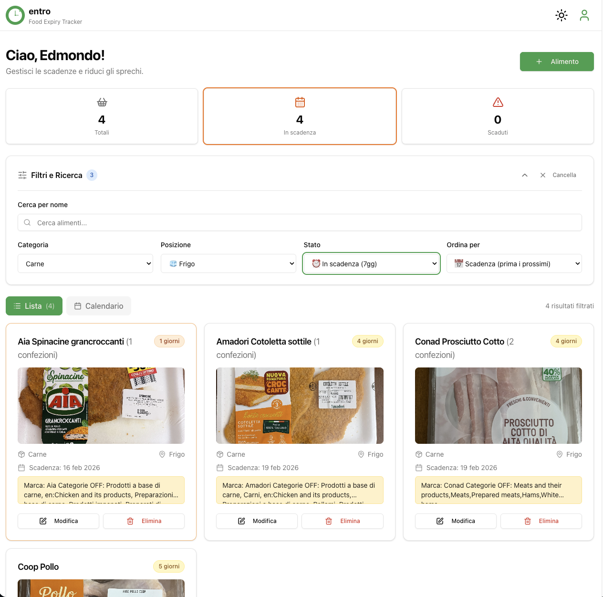
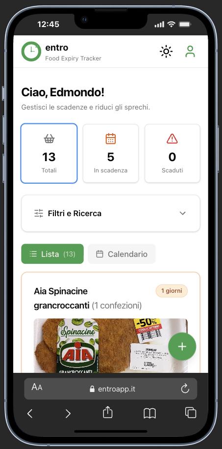

# entro

[](https://app.netlify.com/projects/entro-il/deploys)
[](LICENSE)
[](https://react.dev/)
[](https://www.typescriptlang.org/)
[](https://supabase.com/)
[](https://entroapp.it)

**Gestisci le scadenze alimentari, riduci gli sprechi. Installabile su qualsiasi dispositivo.**

Una Progressive Web App completa per il tracciamento delle scadenze alimentari, con scansione barcode, liste condivise in tempo reale e conformità GDPR. Pensata per famiglie e coinquilini che vogliono sprecare meno cibo.

**[Prova l'app live &rarr;](https://entroapp.it)**

---

## Screenshot

| Dashboard (dark mode) | Filtri e ricerca (light mode) |
|:---:|:---:|
|  |  |

| Aggiunta alimento | Vista mobile |
|:---:|:---:|
|  |  |

---

## Perché questo progetto

Ho sviluppato entro per risolvere un problema concreto: gestire le scadenze alimentari in modo collaborativo. Volevo esplorare un'architettura full-stack moderna con autenticazione, database relazionale, sync real-time e distribuzione come PWA — tutto partendo da un singolo repository.

Il progetto copre l'intero ciclo di vita di un'applicazione web: dal design del database alla compliance GDPR, dalla CI/CD alla gestione di un dominio personalizzato in produzione.

---

## Funzionalità principali

- **CRUD completo** — Aggiungi, modifica, elimina alimenti con immagini, categorie, luogo di conservazione e note
- **Scansione barcode** — Riconosce EAN-13, UPC e QR Code tramite la fotocamera; auto-compila i dati da Open Food Facts
- **Liste condivise** — Un codice invito a 6 caratteri (es. `ABC123`) permette a più utenti di condividere una lista in tempo reale
- **Sync multi-device** — Aggiornamenti istantanei su desktop, iOS e Android tramite Supabase Realtime
- **Vista calendario** — Rolling 7 giorni con gli alimenti in scadenza, organizzati per giorno
- **Swipe gestures** — Swipe destro per modificare, sinistro per eliminare (mobile)
- **Dark mode** — Light, dark e automatico (segue il sistema)
- **PWA installabile** — Installabile da browser su iOS e Android
- **GDPR compliant** — Export dati personali (Art. 20), cancellazione account (Art. 17), Privacy Policy e T&C integrati
- **Feature flags** — Barcode scanner, swipe gestures e liste condivise attivabili via variabili d'ambiente

---

## Tech Stack

| Categoria | Tecnologia |
|---|---|
| **Frontend** | React 19, TypeScript 5.6 |
| **Build Tool** | Vite 6 (SWC) |
| **Styling** | Tailwind CSS 3, shadcn/ui |
| **State Management** | Zustand (client), TanStack Query (server) |
| **Backend** | Supabase (PostgreSQL, Auth, Storage, Realtime, Edge Functions) |
| **Forms** | React Hook Form + Zod |
| **Barcode** | @zxing/browser + Open Food Facts API |
| **Date** | date-fns |
| **PWA** | vite-plugin-pwa (Workbox) |
| **Deploy** | Netlify |

---

## Architettura

```
src/
├── components/
│   ├── auth/           # Login, signup, route protection
│   ├── barcode/        # Scanner modale con ZXing
│   ├── calendar/       # Vista calendario settimanale
│   ├── foods/          # Card, form, lista, swipe gestures
│   ├── layout/         # Header, navigation, app shell
│   ├── settings/       # Account, export dati, eliminazione
│   ├── sharing/        # Inviti, codici, accettazione
│   ├── pwa/            # Banner offline
│   └── ui/             # Primitivi shadcn/ui
├── hooks/              # Custom hooks (auth, foods, theme, network)
├── stores/             # Zustand stores (auth, session)
├── types/              # TypeScript types
├── utils/              # Utility functions
├── pages/              # Route pages (11 pagine)
└── lib/                # Config Supabase, utility classi
```

### Scelte tecniche

- **Zustand + TanStack Query** — Zustand per lo stato UI globale (auth, sessione), React Query per lo stato server (foods, categorie) con cache e invalidazione automatica
- **Supabase Realtime** — LISTEN/NOTIFY di PostgreSQL per sync multi-device, con deduplicazione per evitare flash di aggiornamenti locali
- **Code splitting** — Pagine lazy-loaded, chunk separati per React, Supabase, ZXing e form libraries
- **RLS (Row Level Security)** — Policy multi-livello per isolare i dati tra utenti e gestire l'accesso alle liste condivise
- **Workbox caching** — CacheFirst per font e asset, NetworkFirst per API, signed URL delle immagini con cache di 1 ora

### Schema database

Il database PostgreSQL su Supabase include tabelle per utenti, alimenti, categorie, liste, membri e inviti, con 16+ migration incrementali. Le policy RLS garantiscono l'isolamento dei dati. La cancellazione account usa una funzione RPC con cascade delete manuale.

---

## Avvio rapido

### Prerequisiti

- Node.js 18+
- Account [Supabase](https://supabase.com) (gratuito)

### Installazione

```bash
git clone https://github.com/E-Lop/entro.git
cd entro
npm install
cp .env.example .env.local
```

### Configurazione

1. Crea un progetto su [supabase.com](https://supabase.com)
2. Vai in **Settings → API** e copia `Project URL` e `anon/public key`
3. Incollali in `.env.local`:

```bash
VITE_SUPABASE_URL=https://YOUR_PROJECT_ID.supabase.co
VITE_SUPABASE_ANON_KEY=your-anon-public-key-here
VITE_APP_URL=http://localhost:5173
```

4. Esegui le migration del database (vedi [`docs/private/DATABASE_SCHEMA.md`](docs/private/DATABASE_SCHEMA.md))

5. Avvia il server di sviluppo:

```bash
npm run dev
```

L'app sarà disponibile su `http://localhost:5173`

### Feature flags

Nel file `.env.local` puoi attivare o disattivare le funzionalità opzionali:

```bash
VITE_ENABLE_BARCODE_SCANNER=true
VITE_ENABLE_SWIPE_GESTURES=true
VITE_ENABLE_SHARED_LISTS=true
```

L'integrazione con Open Food Facts è gratuita e non richiede API key.

---

## Build e deploy

```bash
npm run build      # TypeScript check + Vite build → dist/
npm run preview    # Anteprima locale della build
```

Il deploy avviene su **Netlify** con build automatica ad ogni push su `main`:
- Build command: `npm run build`
- Publish directory: `dist`
- Variabili d'ambiente configurate nella dashboard Netlify

---

## Documentazione

| Documento | Contenuto |
|---|---|
| [Project Overview](docs/private/PROJECT_OVERVIEW.md) | Visione e obiettivi del progetto |
| [Technical Specs](docs/private/TECHNICAL_SPECS.md) | Architettura e decisioni tecniche |
| [Features](docs/private/FEATURES.md) | Specifiche funzionalità |
| [Barcode Integration](docs/private/BARCODE_INTEGRATION.md) | Implementazione barcode scanning |
| [Database Schema](docs/private/DATABASE_SCHEMA.md) | Struttura DB e migration |
| [Roadmap](docs/private/ROADMAP.md) | Piano di sviluppo |
| [User Guide](docs/guides/USER_GUIDE.md) | Guida utente |

---

## Contributing

1. Fai un fork del progetto
2. Crea un branch (`git checkout -b feature/NuovaFunzionalita`)
3. Committa le modifiche (`git commit -m 'feat: aggiungi nuova funzionalita'`)
4. Pusha il branch (`git push origin feature/NuovaFunzionalita`)
5. Apri una Pull Request

---

## Licenza

Distribuito sotto licenza [MIT](LICENSE).

## Autore

**Edmondo Domenico Lopez** — [@E-Lop](https://github.com/E-Lop)

## Riconoscimenti

- [Open Food Facts](https://world.openfoodfacts.org/) — Database prodotti alimentari
- [Supabase](https://supabase.com/) — Backend as a Service
- [shadcn/ui](https://ui.shadcn.com/) — Componenti UI
