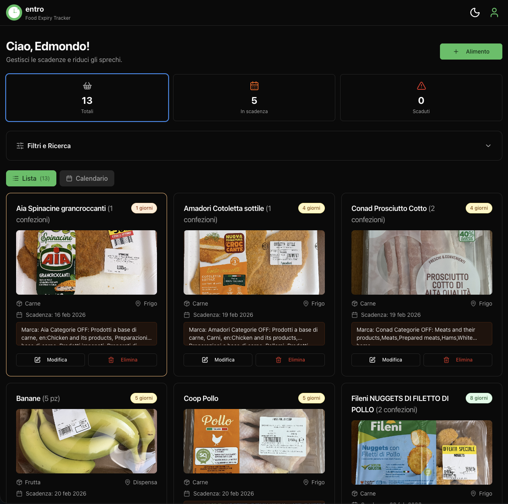
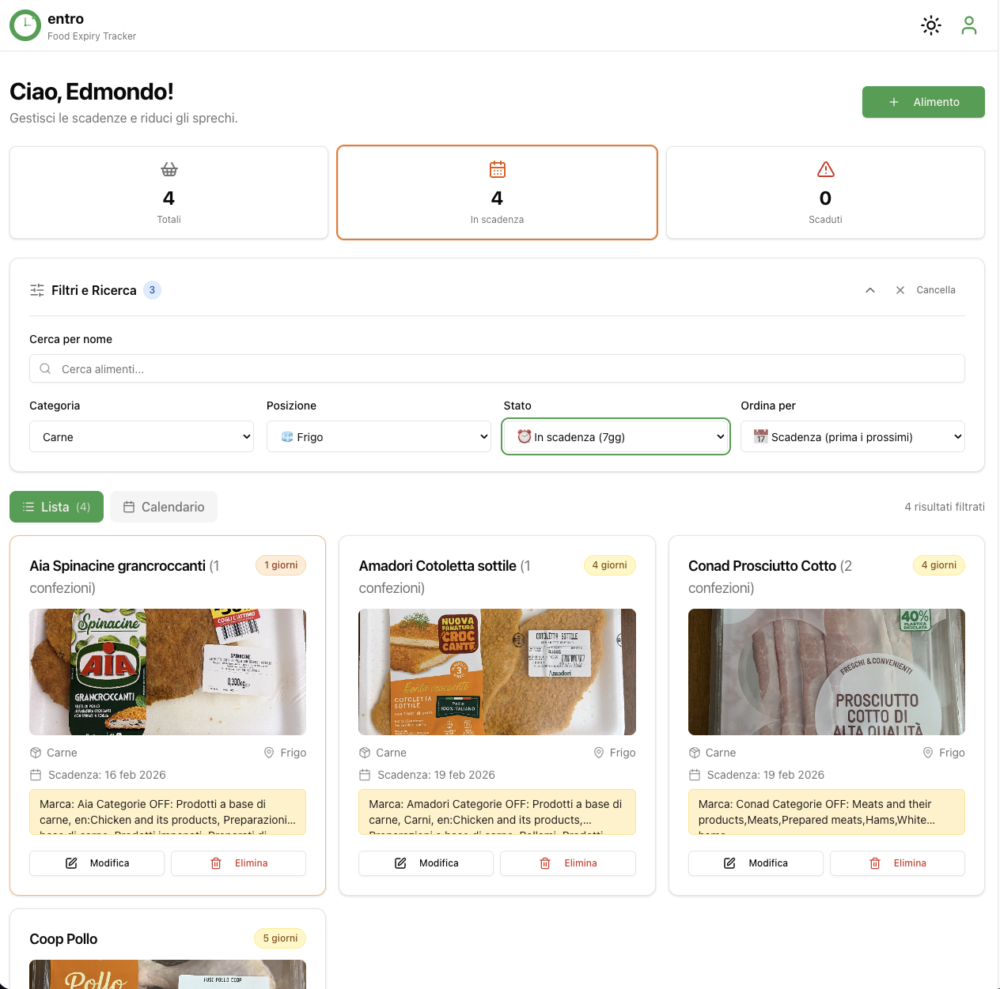
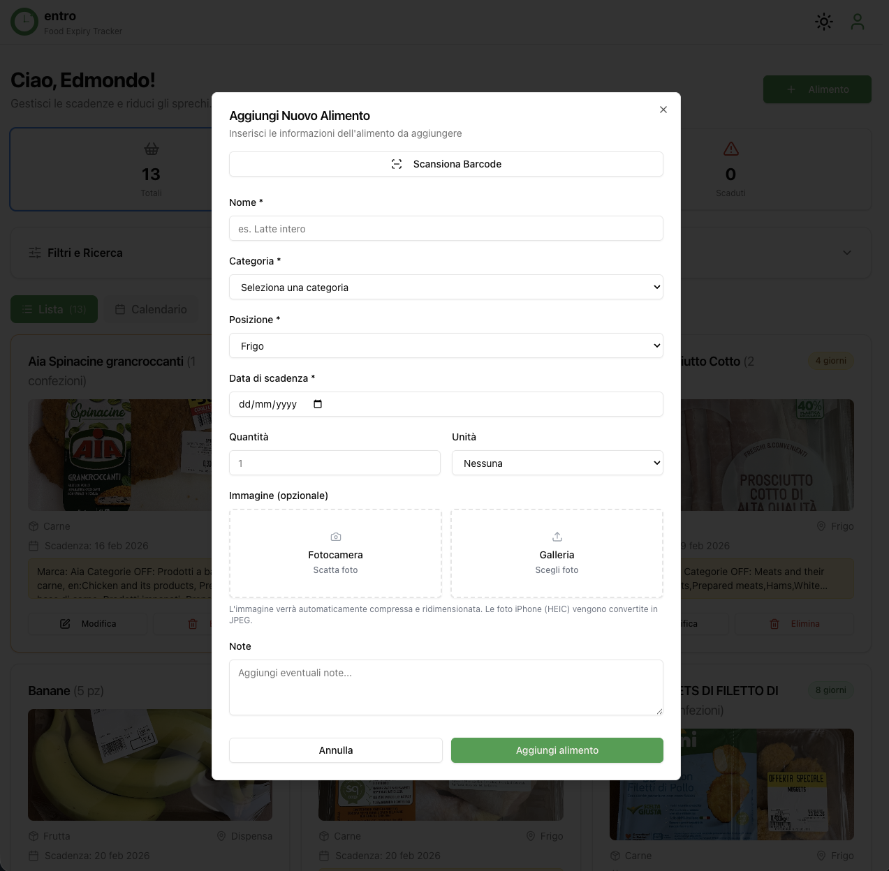
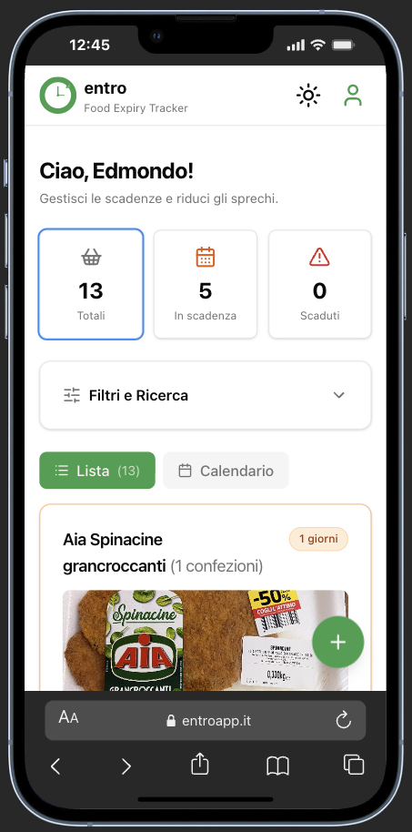

# entro

[](https://github.com/E-Lop/entro/actions/workflows/ci.yml)
[](https://app.netlify.com/projects/entro-il/deploys)
[](LICENSE)
[](https://react.dev/)
[](https://www.typescriptlang.org/)
[](https://supabase.com/)
[](https://entroapp.it)

**Gestisci le scadenze alimentari, riduci gli sprechi. Installabile su qualsiasi dispositivo.**

Una Progressive Web App completa per il tracciamento delle scadenze alimentari, con scansione barcode, liste condivise in tempo reale e conformità GDPR. Pensata per famiglie e coinquilini che vogliono sprecare meno cibo.

**[Prova l'app live &rarr;](https://entroapp.it)**

## What is this?

Entro is an open-source Italian PWA for tracking food expiry dates, reducing waste and sharing a household food list in real time. It is built as a production app and as a public portfolio project.

**[Open the live app &rarr;](https://entroapp.it)**

---

## Screenshot

| Dashboard (dark mode) | Filtri e ricerca (light mode) |
|:---:|:---:|
|  |  |

| Aggiunta alimento | Vista mobile |
|:---:|:---:|
|  |  |

---

## Perché questo progetto

Ho sviluppato entro per risolvere un problema concreto: gestire le scadenze alimentari in modo collaborativo. Volevo esplorare un'architettura full-stack moderna con autenticazione, database relazionale, sync real-time e distribuzione come PWA — tutto partendo da un singolo repository.

Il progetto copre l'intero ciclo di vita di un'applicazione web: dal design del database alla compliance GDPR, dalla CI/CD alla gestione di un dominio personalizzato in produzione.

---

## Funzionalità principali

- **CRUD completo** — Aggiungi, modifica e togli alimenti con immagini, categorie, luogo di conservazione e note. Togliendo un alimento l'app chiede «Com'è finita?» (consumato, buttato, o tolto e basta): la riga resta nel database con `deleted_at` e l'esito, e la foto viene cancellata
- **Scansione barcode** — Riconosce EAN-13, UPC e QR Code tramite la fotocamera; auto-compila i dati da Open Food Facts
- **Liste condivise** — Un codice invito a 6 caratteri (es. `ABC123`) permette a più utenti di condividere una lista in tempo reale
- **Sync multi-device** — Aggiornamenti istantanei su desktop, iOS e Android tramite Supabase Realtime
- **Supporto offline completo** — Cache persistente in IndexedDB, CRUD offline con coda mutazioni e sync automatica al ritorno della connessione
- **Push notifications** — Avvisi giornalieri per alimenti in scadenza, personalizzabili per anticipo, ore silenziose e limite giornaliero
- **Vista calendario** — Agenda verticale dei prossimi 7 giorni: l'intera settimana a colpo d'occhio, ogni giorno con conteggio e urgenza delle scadenze
- **Swipe gestures** — Swipe destro per la modifica rapida della quantità (con accesso alla modifica completa), sinistro per eliminare (mobile)
- **Feedback aptico** — Vibrazione tattile su swipe, creazione, modifica ed eliminazione alimenti (su Android con browser basati su Chromium che implementano la Vibration API; non disponibile su iOS/Safari, e Firefox non la attiva)
- **Dark mode** — Light, dark e automatico (segue il sistema)
- **PWA installabile** — Installabile da browser su iOS e Android con esperienza offline nativa
- **GDPR** — Export dei dati personali (Art. 20) e cancellazione dell'account (Art. 17) dalle Impostazioni; Privacy Policy, Termini e Cookie Policy su LegalBlink, linkate dal footer e dalla registrazione. Come funziona nel codice: [Come entro implementa il GDPR](docs/guides/privacy.md)
- **Feature flag** — `VITE_ENABLE_SHARED_LISTS=false` nasconde la voce «Inviti» del menu utente

---

## Tech Stack

| Categoria | Tecnologia |
|---|---|
| **Frontend** | React 19, TypeScript 5.6 |
| **Build Tool** | Vite 8 (SWC) |
| **Styling** | Tailwind CSS 3, shadcn/ui |
| **State Management** | Zustand (client), TanStack Query (server) |
| **Offline** | IndexedDB (idb-keyval), PersistQueryClient, mutation queue |
| **Backend** | Supabase (PostgreSQL, Auth, Storage, Realtime, Edge Functions) |
| **Push Notifications** | Web Push API (VAPID), @negrel/webpush (Deno) |
| **Forms** | React Hook Form + Zod |
| **Barcode** | @zxing/browser + Open Food Facts API |
| **Date** | date-fns |
| **PWA** | vite-plugin-pwa (Workbox), custom service worker |
| **Deploy** | Netlify |

---

## Architettura

```
src/
├── components/
│   ├── auth/           # Login, signup, route protection
│   ├── barcode/        # Scanner modale con ZXing
│   ├── calendar/       # (cartella placeholder)
│   ├── common/         # (cartella placeholder)
│   ├── foods/          # Card, form, lista, vista calendario (agenda), swipe gestures
│   ├── guide/          # Guida rapida e help in-app
│   ├── layout/         # Header, navigation, app shell
│   ├── settings/       # Account, notifiche, export dati, eliminazione
│   ├── sharing/        # Inviti, codici, accettazione
│   ├── pwa/            # Banner offline, prompt notifiche
│   ├── theme/          # ThemeProvider: tema chiaro, scuro, automatico
│   └── ui/             # Primitivi shadcn/ui
├── hooks/              # Custom hooks (auth, foods, theme, network, push)
├── stores/             # Zustand store (authStore: utente e sessione)
├── types/              # TypeScript types
├── utils/              # Utility functions
├── pages/              # Route pages
├── lib/                # Config Supabase, persistenza offline, push notifications
└── sw.ts               # Service worker custom (cache, push handlers)

supabase/
├── functions/          # Edge Functions (inviti, push, notifiche di scadenza) + helper condivisi (_shared)
├── migrations/         # Catena canonica delle migrazioni
└── tests/              # Test pgTAP del database
```

### Scelte tecniche

- **Zustand + TanStack Query** — Zustand per lo stato UI globale (auth, sessione), React Query per lo stato server (foods, categorie) con cache e invalidazione automatica
- **Offline-first** — Cache React Query persistita in IndexedDB via `idb-keyval`; mutazioni offline accodate e riprese automaticamente al ritorno della connessione, anche dopo ricaricamento della pagina
- **Supabase Realtime** — LISTEN/NOTIFY di PostgreSQL per sync multi-device, con deduplicazione per evitare flash di aggiornamenti locali
- **Push notifications** — Web Push API con VAPID; Edge Function cron giornaliera per invio notifiche scadenza; `@negrel/webpush` (JSR) per compatibilità Deno
- **Code splitting** — Pagine lazy-loaded, chunk separati per React, Supabase, ZXing e form libraries
- **RLS (Row Level Security)** — Policy multi-livello per isolare i dati tra utenti e gestire l'accesso alle liste condivise
- **Service worker custom** — Precaching Workbox per bundle, CacheFirst per font e immagini Supabase (normalizzazione signed URL, 200 entry, 7 giorni), fallback SPA per navigazione offline

### Schema database

Il database PostgreSQL su Supabase ha tabelle per alimenti, categorie, liste, membri, inviti, sottoscrizioni push e preferenze di notifica; gli utenti stanno in `auth.users`. La catena canonica delle migrazioni è in [`supabase/migrations/`](supabase/migrations/), a partire da una baseline dello schema; la cartella `migrations/` è un archivio delle migrazioni storiche e non va applicata. Le policy RLS isolano i dati tra utenti e liste.

Togliere un alimento è una UPDATE, non una DELETE: imposta `deleted_at` e, se l'utente sceglie un esito, `status` (`consumed` o `wasted`). La cancellazione dell'account passa dalla RPC `delete_user()`; un trigger su `auth.users` elimina le liste di cui l'utente era l'unico membro, con i loro alimenti, e lascia agli altri membri le liste condivise.

---

## Avvio rapido

### Prerequisiti

- Node.js 20.19+ o 22.12+ (lo richiede Vite 8; CI e Netlify usano Node 20)
- Account [Supabase](https://supabase.com) (gratuito)

### Installazione

```bash
git clone https://github.com/E-Lop/entro.git
cd entro
npm install
cp .env.example .env.local
```

### Configurazione

1. Crea un progetto su [supabase.com](https://supabase.com)
2. Vai in **Settings → API** e copia `Project URL` e `anon/public key`
3. Incollali in `.env.local`:

```bash
VITE_SUPABASE_URL=https://YOUR_PROJECT_ID.supabase.co
VITE_SUPABASE_ANON_KEY=your-anon-public-key-here
# Chiave pubblica VAPID: senza, le notifiche push non si attivano
VITE_VAPID_PUBLIC_KEY=your-vapid-public-key-here
# Facoltativa: vuota, il pulsante Ko-fi non compare
VITE_KOFI_URL=
```

4. Applica le migrazioni di [`supabase/migrations/`](supabase/migrations/) al tuo progetto: `supabase link --project-ref <ref>` e poi `supabase db push`

5. Avvia il server di sviluppo:

```bash
npm run dev
```

L'app sarà disponibile su `http://localhost:5173`

### Feature flag

L'unico flag che il codice legge è `VITE_ENABLE_SHARED_LISTS`: con un valore diverso da `true` sparisce la voce «Inviti» del menu utente (`src/components/sharing/InviteMenuItem.tsx`). Il resto della condivisione, come la pagina `/join/:code`, non lo legge.

```bash
VITE_ENABLE_SHARED_LISTS=true
```

`VITE_ENABLE_BARCODE_SCANNER`, `VITE_ENABLE_SWIPE_GESTURES` e `VITE_ENABLE_NOTIFICATIONS` compaiono ancora in `.env.example` e `netlify.toml`, ma nessun file di `src/` li legge: scansione, swipe e notifiche non dipendono da nessun flag.

L'integrazione con Open Food Facts è gratuita e non richiede API key.

---

## Build e deploy

```bash
npm run build      # TypeScript check + Vite build → dist/
npm run preview    # Anteprima locale della build
```

Il deploy avviene su **Netlify** con build automatica ad ogni push su `main`:
- Build command: `npm run build`
- Publish directory: `dist`
- Alcune variabili sono fissate in `netlify.toml`; quelle che il file non contiene (`VITE_SUPABASE_URL`, `VITE_SUPABASE_ANON_KEY`, `VITE_VAPID_PUBLIC_KEY`, `VITE_KOFI_URL`) vanno nella dashboard Netlify
- Edge Functions, secret e cron si pubblicano a parte su Supabase: vedi la [guida al deploy](docs/guides/DEPLOY.md)

---

## Documentazione

| Documento | Contenuto |
|---|---|
| [Guida utente](docs/guides/USER_GUIDE.md) | Come si usa l'app; le sezioni sono le stesse della guida in app su `/guida` |
| [Changelog](CHANGELOG.md) | Storico delle versioni e modifiche |
| [Contribuire](CONTRIBUTING.md) | Setup locale, comandi di verifica, regole database, release |
| [Sicurezza](SECURITY.md) | Come segnalare una vulnerabilità |
| [Design system](DESIGN.md) | Palette, tipografia, componenti |
| [Deploy Guide](docs/guides/DEPLOY.md) | Deploy su Netlify e Supabase |
| [Come entro implementa il GDPR](docs/guides/privacy.md) | Dati raccolti, export, cancellazione, terze parti, com'è fatto nel codice |
| [Privacy Policy](https://app.legalblink.it/api/documents/697e24efc95cff002359012c/privacy-policy-per-siti-web-o-e-commerce-it) | La policy legale, su LegalBlink |

---

## Contributing

1. Fai un fork del progetto
2. Crea un branch (`git checkout -b feature/NuovaFunzionalita`)
3. Committa le modifiche (`git commit -m 'feat: aggiungi nuova funzionalita'`)
4. Pusha il branch (`git push origin feature/NuovaFunzionalita`)
5. Apri una Pull Request

---

## Licenza

Distribuito sotto licenza [MIT](LICENSE).

## Autore

**Edmondo Domenico Lopez** — [@E-Lop](https://github.com/E-Lop)

## Riconoscimenti

- [Open Food Facts](https://world.openfoodfacts.org/) — Database prodotti alimentari
- [Supabase](https://supabase.com/) — Backend as a Service
- [shadcn/ui](https://ui.shadcn.com/) — Componenti UI
